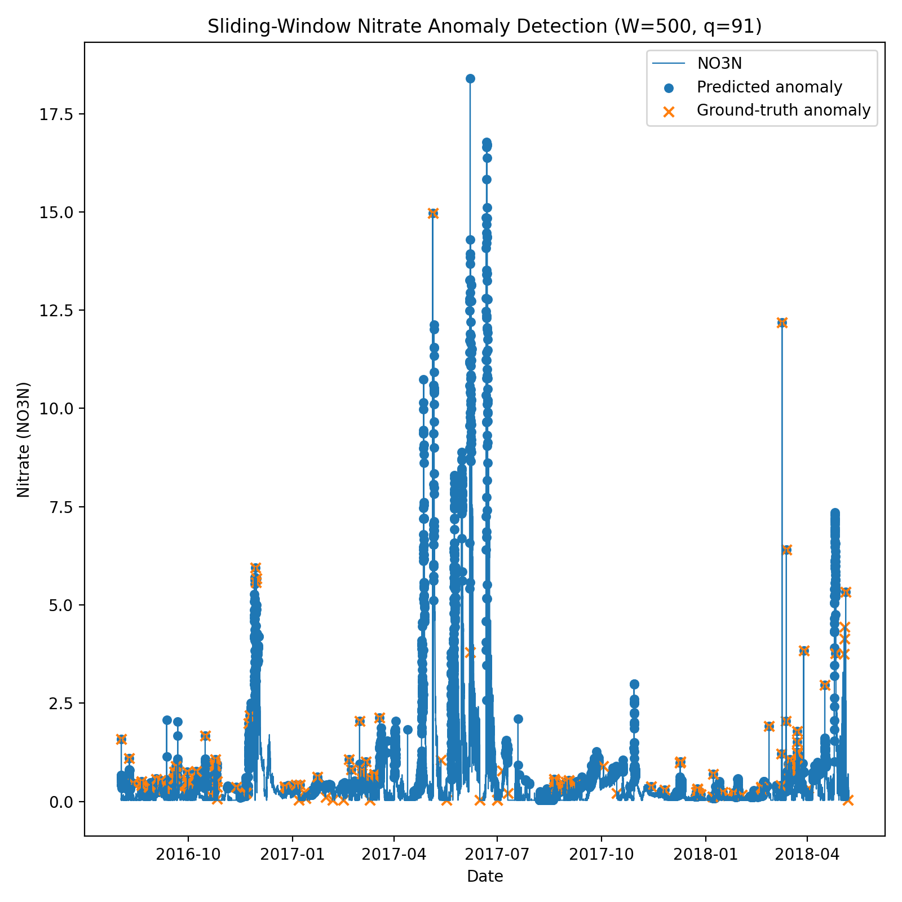

# HW2 - Overlapping Sliding Windows Anomaly Detection

## Project Summary
This assignment implements a threshold-based anomaly detector for nitrate level time series data using overlapping sliding windows. The dataset provided (`AG_NO3_fill_cells_remove_NAN.csv`) tracks nitrate values in the `NO3N` column against binary ground-truth labels in `Student_Flag`. 

The main goal was to adjust an adaptive percentile threshold to flag unusually high nitrate spikes while meeting two minimum classification accuracy thresholds:
- Normal event accuracy ≥ 80%
- Anomaly event accuracy ≥ 75%

## Methodology & Parameters
I used a fixed window size with a step size of 1 data point:
* **Window size ($W$):** 500 points
* **Percentile ($q$):** 91st percentile (one-sided upper tail)
* **Step size:** 1

### How the window moves:
1. **Initial Window:** For the very first 500 observations, the threshold is computed directly off those initial 500 values using `np.percentile(x[0:500], 91, method="linear")`. All initial 500 points are evaluated using this initial cutoff.
2. **Sliding Forward:** For every subsequent step, the window slides forward by 1 point. The 91st percentile threshold recalculates using only the 500 points currently inside that shifted window, and only the single newly added data point is classified.
3. **Threshold Condition:** Any point whose nitrate value meets or exceeds its active window's threshold is marked as an anomaly.

## Parameter Selection ($W$ and $q$)
I went with $W = 500$ because it's large enough to smooth out small local noise and calculate a stable baseline percentile without lagging behind long-term trends in the time series. 

Setting $q = 91$ balanced the trade-off between sensitivity and precision:
- Pushing $q$ higher made the model miss too many real spikes, dropping anomaly detection accuracy below 75%.
- Lowering $q$ flagged too many routine fluctuations, driving down normal accuracy below the 80% threshold.

## Results
Out of 141 ground-truth anomalies in the dataset:

* **True Positives (TP):** 106
* **False Positives (FP):** 4363
* **False Negatives (FN):** 35
* **True Negatives (TN):** 26286

### Target Check
* **Normal Event Accuracy:** $26286 / 30649 = \mathbf{85.76\%}$ (Target: $\ge 80\%$) — **Passed**
* **Anomaly Event Accuracy:** $106 / 141 = \mathbf{75.18\%}$ (Target: $\ge 75\%$) — **Passed**

While the false positive count is noticeable, it's expected given the heavy class imbalance and the tight cutoff needed to hit the 75% anomaly recall requirement.

## Plot
The visual comparison (`anomaly_detection_plot.png`) shows the raw nitrate time series line overlaid with predicted anomalies (circles) against the ground-truth flags (X markers). 

## Design Choices & Code
- **Upper-tail cutoff:** Focused strictly on high-end spikes since environmental nitrate contamination is characterized by high concentrations.
- **Data prep:** The script verifies missing values in `NO3N` before starting the sliding loop.

### Project Files
- `homework_2_overlapping_sliding_windows_anomaly_detection.py` (Script for processing, metric calculations, and plotting)
- `README.md`
- `anomaly_detection_plot.png`
